<div align="center">

# 🎓 FYPCompass

### Final Year Project Management System for Malaysian Private Universities

A centralized web-based platform that streamlines the Final Year Project (FYP) workflow by connecting **Students**, **Supervisors**, **Coordinators**, and **Examiners** in a single system.

🌐 **Live Demo**

https://fyp-compass-omega.vercel.app/#/login


</div>

---

# 📖 Table of Contents

- Overview
- Problem Statement
- Features
- Live Demo
- Technology Stack
- Screenshots
- Project Structure
- Installation
- Available Scripts
- User Roles
- Future Improvements
- Academic Context
- Authors
- License

---

# 📌 Overview

FYPCompass is a web-based Final Year Project (FYP) management system designed specifically for Malaysian private universities.

Traditional FYP supervision typically relies on multiple disconnected platforms such as email, WhatsApp, Google Drive, spreadsheets, and learning management systems. This fragmented workflow often leads to missed deadlines, scattered documentation, duplicated administrative work, and limited visibility into student progress.

FYPCompass centralizes the entire supervision process into a single platform, allowing students, supervisors, coordinators, and examiners to collaborate efficiently throughout the complete FYP lifecycle.

This project was developed as a prototype for the **BIS2102 Information Systems Analysis & Design Mini Project**.

---

# ❗ Problem Statement

Many universities still manage Final Year Projects using multiple independent platforms.

As a result:

- Communication is scattered across different applications
- Consultation records are difficult to trace
- Project milestones are not centrally monitored
- Supervisors spend excessive time on administrative tasks
- Coordinators lack a complete overview of student progress
- Examiners cannot easily access project history

FYPCompass addresses these challenges by providing one integrated platform for FYP management.

---

# ✨ Features

## 👨‍🎓 Student

- Submit project proposals
- Upload milestone deliverables
- Track project progress
- View milestone timeline
- Receive supervisor feedback
- View consultation records
- Receive notifications

---

## 👨‍🏫 Supervisor

- Dashboard overview
- Review student submissions
- Provide feedback
- Monitor student progress
- Manage consultation records
- Configure supervision settings

---

## 🏫 Coordinator

- Monitor overall FYP cohort
- Manage students
- Manage supervisors
- Assign supervisors
- View cohort statistics

---

## 📝 Examiner

- View assigned students
- Review complete project history
- View consultation records
- Submit project evaluations

---

# 🌐 Live Demo

### Website

https://fyp-compass-omega.vercel.app/#/login

---

# 📸 Screenshots

> Screenshots are located inside `/screenshots`.

## Login

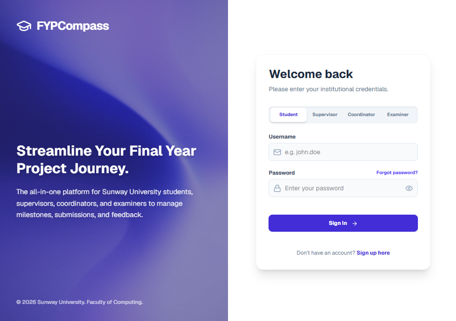

---

## Student Dashboard

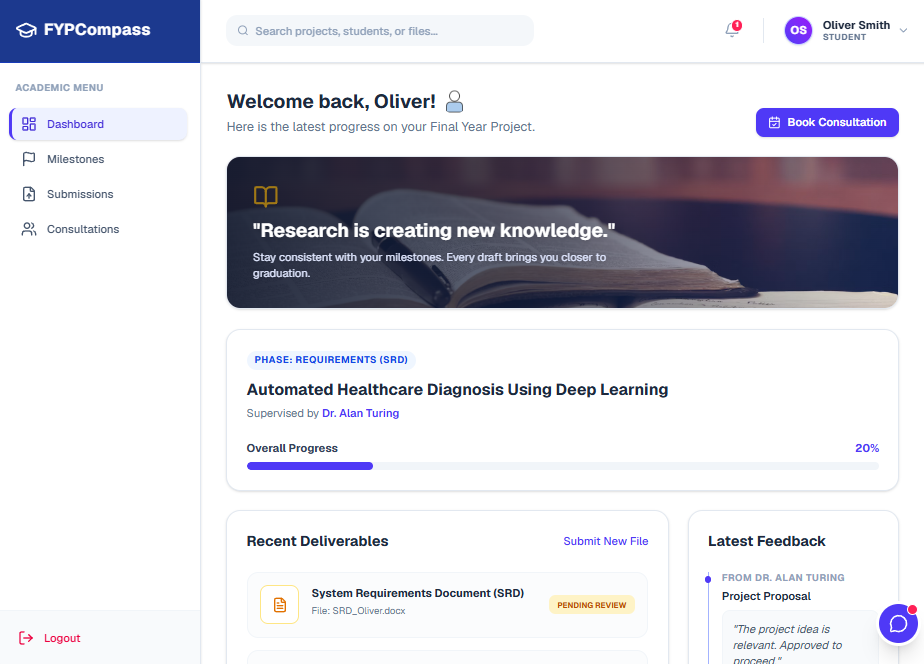

---

## Proposal Submission

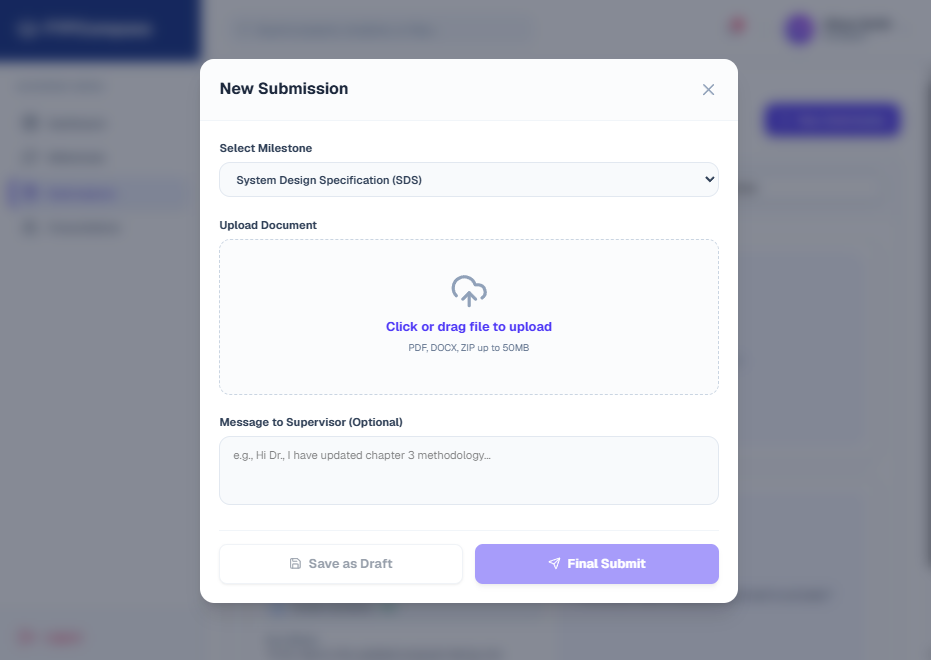

---

## Milestone Timeline

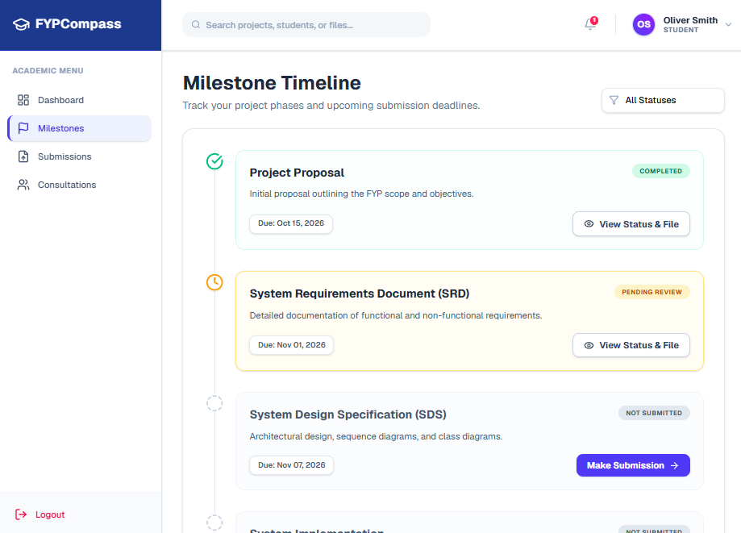

---

## Consultation Records

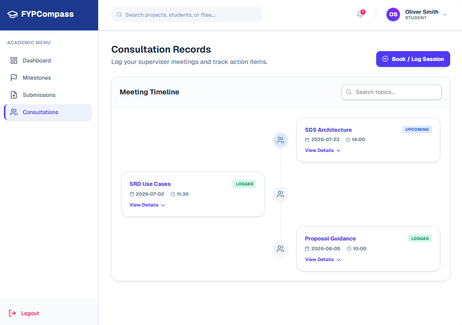

---

## Supervisor Dashboard

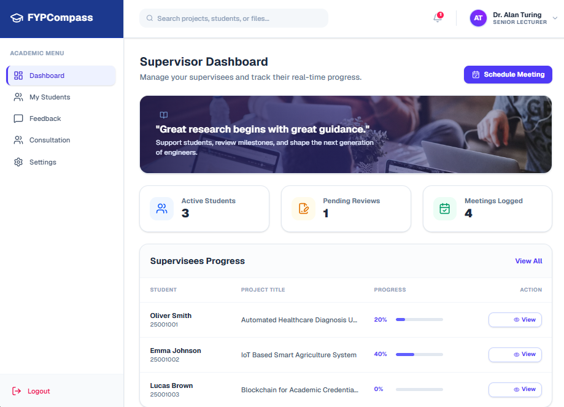

---

## Student Progress

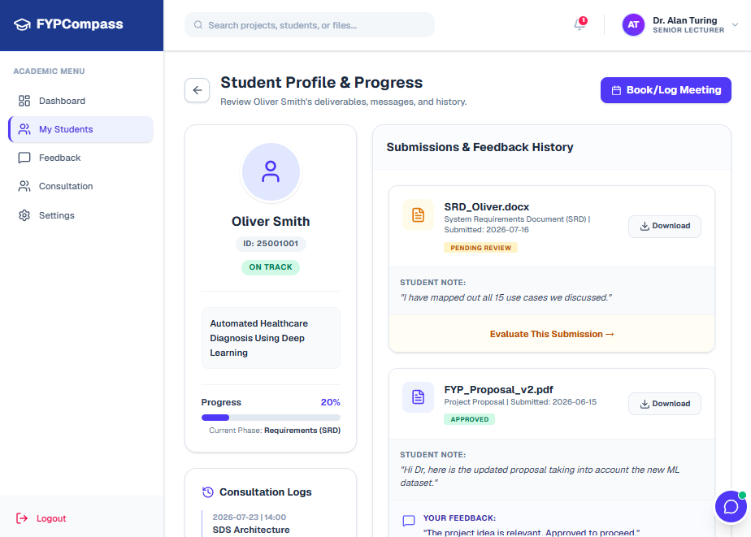

---

## Feedback Management

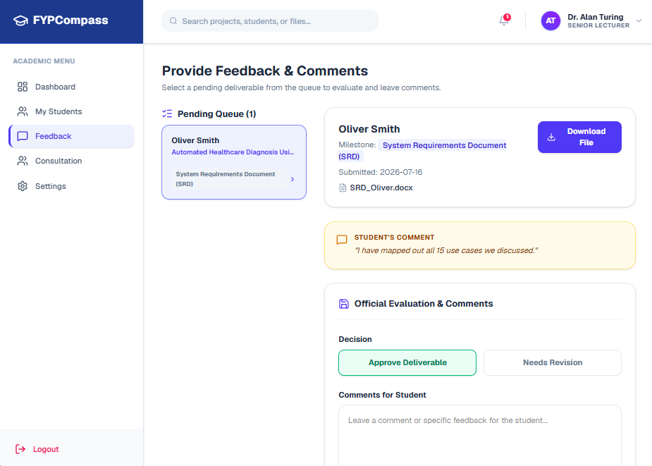

---

## Coordinator Dashboard

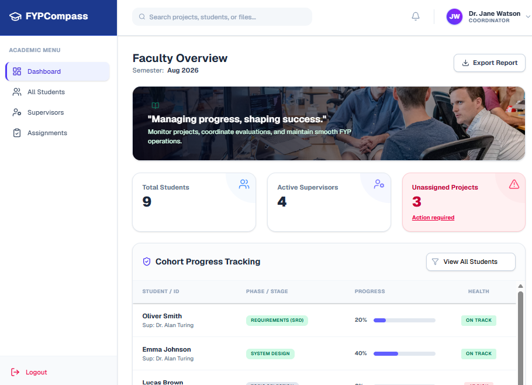

---

## Student Management

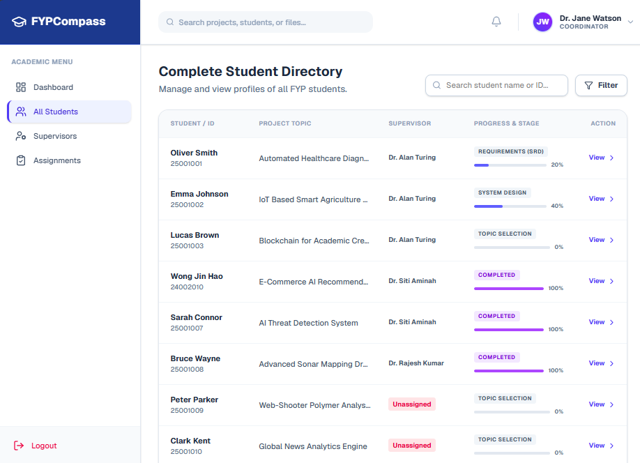

---

## Supervisor Assignment

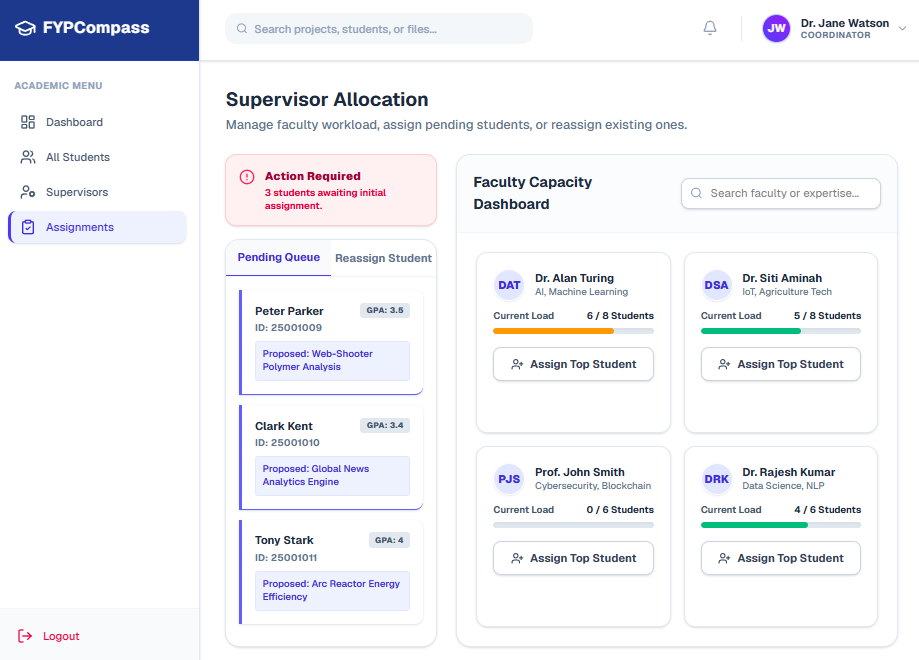

---

## Examiner Dashboard

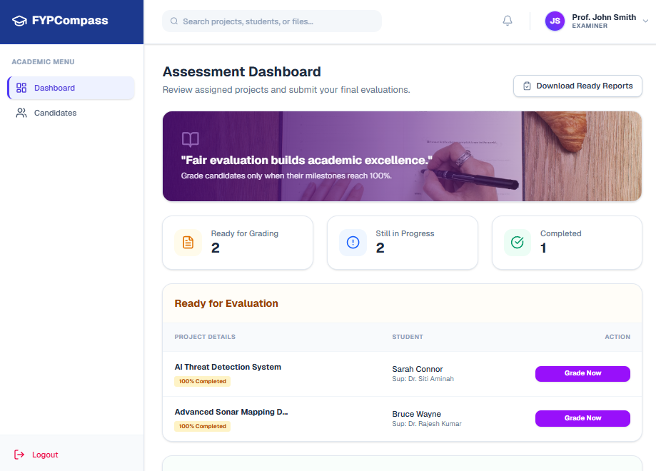

---

## Project Evaluation

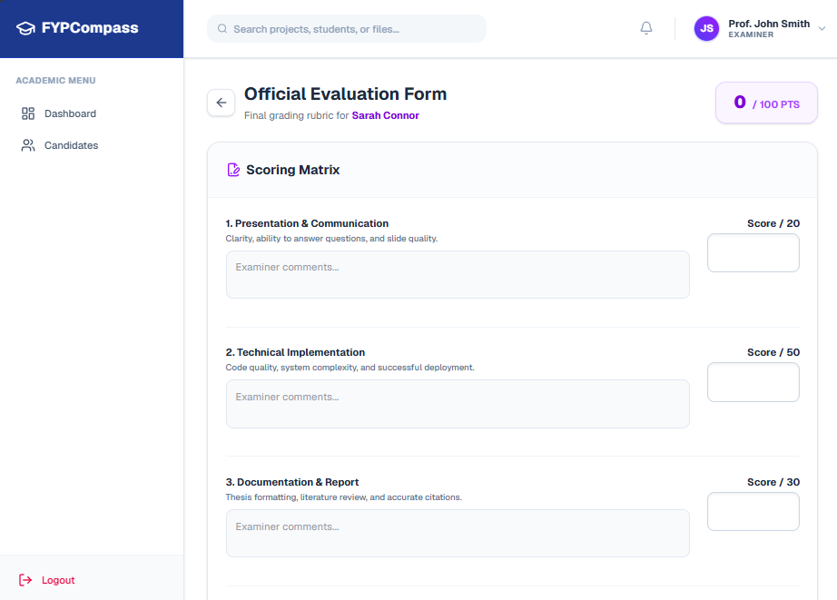

---

# 🛠 Technology Stack

| Category | Technology |
|-----------|------------|
| Frontend | React 19 |
| Build Tool | Vite |
| Routing | React Router (HashRouter) |
| Styling | Tailwind CSS v4 |
| UI Components | shadcn/ui + Base UI |
| Charts | Recharts |
| Icons | Lucide React |
| State Management | React Context API |
| Deployment | Vercel |

---

# 📂 Project Structure

```text
FYPCompass
│
├── client
│   ├── src
│   │
│   ├── assets
│   │
│   ├── components
│   │   └── layout
│   │       ├── Navbar
│   │       ├── Sidebar
│   │       └── MainLayout
│   │
│   ├── context
│   │   └── DataContext
│   │
│   ├── data
│   │
│   ├── pages
│   │   ├── student
│   │   ├── supervisor
│   │   ├── coordinator
│   │   └── examiner
│   │
│   ├── App.jsx
│   └── main.jsx
│
├── screenshots
│
├── README.md
│
└── package.json
```

---

# 🚀 Installation

Clone the repository

```bash
git clone https://github.com/LEH268/FYPCompass.git
```

Navigate into the project

```bash
cd FYPCompass
```

Install dependencies

```bash
npm install
```

Run development server

```bash
npm run dev
```

---

# 📜 Available Scripts

Start development server

```bash
npm run dev
```

Build production

```bash
npm run build
```

Preview production

```bash
npm run preview
```

Run ESLint

```bash
npm run lint
```

---

# 👥 User Roles

| Role | Main Functions |
|-------|----------------|
| Student | Proposal Submission, Milestone Tracking, Consultation Records |
| Supervisor | Student Progress, Submission Review, Feedback Management |
| Coordinator | Dashboard, Student Management, Supervisor Assignment |
| Examiner | Project Evaluation, Project History |

---

# 🚧 Future Improvements

- Backend API integration
- MySQL database
- Secure authentication
- Role-based authorization
- File upload and cloud storage
- Email notifications
- Deadline reminders
- Calendar integration
- Real-time notifications
- AI-powered project analytics
- Plagiarism detection integration
- Viva scheduling module

---

# 🎓 Academic Context

FYPCompass is an academic prototype developed as part of the **BIS2102 Information Systems Analysis & Design Mini Project**.

The project demonstrates the analysis, design, and implementation of a centralized web-based Final Year Project management system that improves supervision efficiency, communication, and project monitoring within Malaysian private universities.

---

# 👨‍💻 Authors

Developed by

- Lee Earn Hui
- Grace Wong Xin En

---

# 📄 License

This project was developed for academic purposes only as part of the **BIS2102 Information Systems Analysis & Design Mini Project**.

Commercial use is not permitted without permission from the authors.

---
